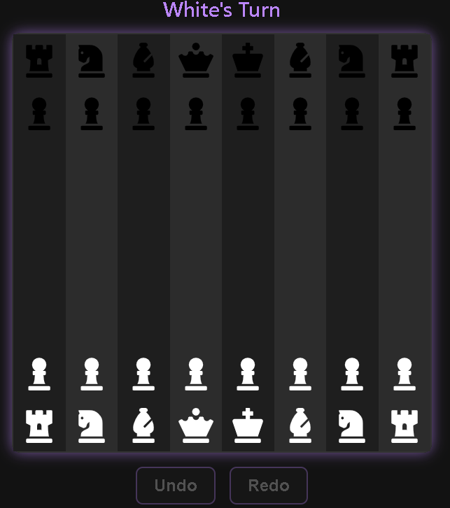
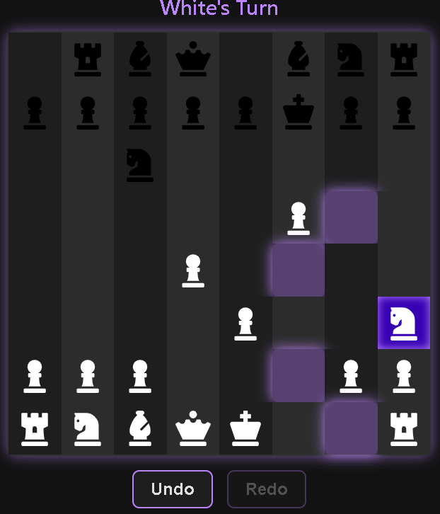

# ♟️ Chess Game – AI Powered

This folder contains the source code and resources for the **AI-based Chess** game developed as part of the **CSE-412: Artificial Intelligence** course.

## 📌 Overview

A React-based Chess game where the player controls **White** pieces and the AI controls **Black** pieces. The AI uses a **Minimax algorithm** with evaluation heuristics to decide moves. The game features undo/redo functionality, move highlighting, and real-time game status updates.

---

## 🚀 How to Run the Game

### 🔧 Prerequisites

Ensure the following are installed on your machine:

- **Node.js** (v16+ recommended)
- **npm** or **yarn**
- **Electron** (comes with the dependencies)
- Internet access for first install

---

### 📦 Installation

```bash
git clone https://github.com/srabonti03/AI-Course.git
cd AI-Course/AI\ Games/Chess/chess-game-app
npm install
```

---

### ▶️ Run the Game

```bash
npm run dev       # For development mode (hot reload)
npm run build     # To build the app for production
npm run electron  # To launch the game via Electron
```

---

## 🧠 Algorithm Used
The AI uses the **Minimax algorithm** with a depth-limited search (default depth = 2) and an evaluation function based on chess piece values to assess board positions from Black’s perspective.

---

## 🕹️ How to Play

- You control the **White** pieces, and the AI controls the **Black** pieces.
- Click on your piece to select it; valid moves will be highlighted.
- Click on a highlighted square to move the piece.
- Use the **Undo** and **Redo** buttons to navigate move history.
- The game shows status updates such as whose turn it is and check/checkmate/draw notifications.

---

## 💻 Frameworks and Libraries Used

- **React.js** – Frontend framework
- **chess.js** – Chess game logic and move validation
- **Electron** – Desktop app wrapper
- **SCSS** – Styling preprocessor for modular and maintainable CSS
- **react-icons, react-hot-toast** – For UI enhancement and notifications
- **vite** – Development server and bundler
- **minimax** – Custom-implemented inside the logic

---

## 📷 Screenshots

<p align="center">
  <table>
    <tr>
      <td align="center">
        <br/>
        <em>Initial chessboard with pieces set up</em>
      </td>
      <td align="center">
        <br/>
        <em>Chess Gameplay</em>
      </td>
      <td align="center">
        <br/>
        <em>Game over with checkmate</em>
      </td>
    </tr>
  </table>
</p>

---

## 📁 Folder Structure

```bash
chess-game-app/
├── src/                     # React components and game logic
│   └── Chess.jsx
├── electron.js              # Electron main process (if used)
├── vite.config.js           # Vite build configuration
├── package.json             # Dependencies and scripts
├── dist/                    # Production build output
├── screenshots/             # Game screenshots
└── README.md                # Project documentation
```

---

## 👩‍💻 Author

**Srabonti Suchi Talukdar**
Department of Computer Science & Engineering
North East University Bangladesh

---

## 📜 License

This project is intended for **academic use only** as part of the course **CSE-412: Artificial Intelligence**. It is **not licensed for commercial use or redistribution**.
