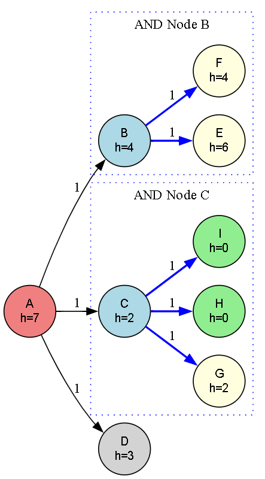

# 🔍 A* Search Algorithm in AND-OR Graphs

This project implements the **A\*** Search Algorithm to find an **optimal path** in a graph that includes both **AND** and **OR** relationships between nodes. The algorithm uses heuristics to determine the most promising path towards the goal node.

---

## 🚀 About This Algorithm

The A* algorithm is widely used in AI and graph search problems to find the shortest path efficiently. This implementation handles AND-OR graphs — where nodes can have conjunctive (AND) or disjunctive (OR) child relationships — enhancing classic A* to more complex structures.

---

## 🧠 How the Algorithm Works

The A* algorithm is a **best-first search** technique that finds the **least-cost path** from a start node to a goal node by considering both:

- `g(n)`: Actual cost from the start node to the current node.
- `h(n)`: Heuristic estimated cost from the current node to the goal.

The total estimated cost `f(n)` is:

```text
f(n) = g(n) + h(n)
```
---

### 🪜 Steps:

1. Start from the initial node (`A`).
2. Add it to a **priority queue (min-heap)** using `f(n)` as the key.
3. Expand the node with the **lowest f(n)** value.
4. For each child:
   - Calculate the tentative cost `g(n)`.
   - If it’s lower than a previous path, update it and add to the queue.
5. Repeat until the **goal node** is found or the queue is empty.

---

### 📌 Special Case: AND-OR Relationships

- **OR Nodes**: Choose any one of the children.
  - Example: `A → B` **or** `A → C` **or** `A → D`
- **AND Nodes**: All children must be satisfied.
  - Example: `B → E` **and** `F` (both must be processed)

> **Note:** This implementation assumes **OR** semantics in traversal. A complete AND-OR graph solver would need additional logic for AND aggregation.

---

## 🖼️ Input & Output

### 📥 Input Graph Structure

<p align="center">
  
  <br/>
  <em>A* Search Algorithm Graph with AND-OR Node Relationships</em>
</p>

---

### 📤 Output Path

```python
Optimal Solution Path:  A -> C -> H
```

---

## 🌍 Applications of A*

- 🗺️ **Navigation Systems** (Google Maps, GPS routing)  
- 🎮 **Game AI Pathfinding**  
- 🧠 **Robotics Planning**  
- 🧩 **Puzzle Solvers** (8-puzzle, maze solving)  
- 🤖 **Decision Trees & Planning**  

---

## ⏱️ Time & Space Complexity

<div align="center">

| Type             | Complexity                   |
|------------------|-----------------------------|
| **Time Complexity**  | O(E) (where E is number of edges)  |
| **Space Complexity** | O(V) (where V is number of nodes)  |

</div>

> Heuristic quality affects performance. A perfect heuristic gives optimal performance.

