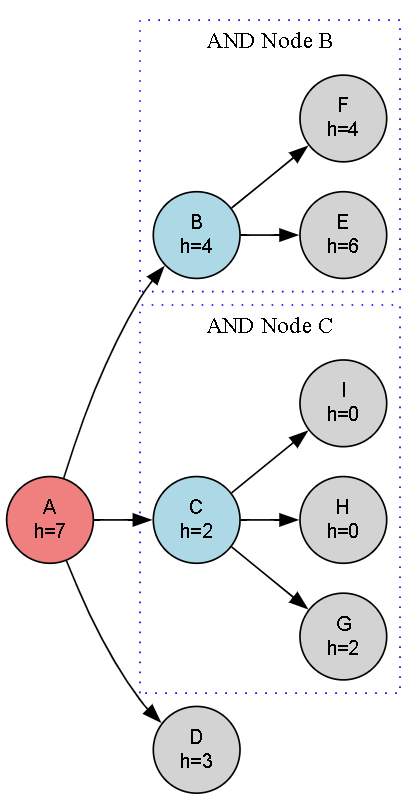

# 🔗 AO* Algorithm for AND-OR Graphs

This code implements the AO* (And-Or Star) algorithm, used for searching in AND-OR graphs with heuristic cost estimation. It finds the optimal solution path by evaluating AND and OR nodes, combining heuristic costs and path costs efficiently.

---

## 🚀 About This Algorithm

AO* is a best-first search algorithm tailored for AND-OR graphs, where nodes represent problem decompositions into subproblems with AND/OR relationships:

- **OR nodes** represent alternative choices (select one child).
- **AND nodes** represent conjunctions of subproblems (all children must be solved).

AO* uses heuristics to guide search towards the minimum cost solution graph and dynamically updates costs and solution paths as it explores the graph.

---

## 🧠 How the Algorithm Works

- It starts at the root node and evaluates child nodes based on AND or OR semantics.
- For **OR nodes** `(like 'A')`, it selects the child with the minimum combined cost `(path cost + heuristic)`.
- For **AND nodes** `(like 'B' and 'C')`, it sums the costs of all children and their heuristics.
- Heuristic values are updated during the search to reflect improved cost estimates.
- The search continues recursively, updating solution paths and pruning suboptimal branches.

---

### 🪜 Steps:

1. Start at the root node.
2. Calculate minimum cost children considering AND/OR relations.
3. Update heuristic cost for the current node.
4. Recursively apply AO* to child nodes (all children for AND nodes, best child for OR nodes).
5. Maintain a solution graph recording the current best path(s).
6. Repeat until the solution graph reaches terminal nodes with minimal cost.
---

## 🖼️ Input & Output

### 📥 Input Graph Structure

<p align="center">
  
  <br/>
  <em>AO* Algorithm AND-OR Graph Visualization</em>
</p>

---

### 📤 Output Path

```python
Optimal Solution Path:
A
  C
    G
    H
    I

The optimal value from node 'A' is: 3
```
---

## 🌍 Applications of AO*

- 🗺️ **Navigation Systems (route planning with alternative and combined paths)**  
- 🤖 **AI Planning & Decision Making (multi-step task decompositions)**  
- 🧩 **Puzzle Solvers (complex problem decomposition)**  
- 🎮 **Game AI (AND-OR decision trees with heuristics)**  

---

## ⏱️ Time & Space Complexity

<div align="center">

| Type             | Complexity                   |
|------------------|-----------------------------|
| **Time Complexity**  | Exponential in worst case  |
| **Space Complexity** | Proportional to depth & breadth  |

</div>

> AO* uses heuristics to prune and focus search, often performing much better than brute-force search.

