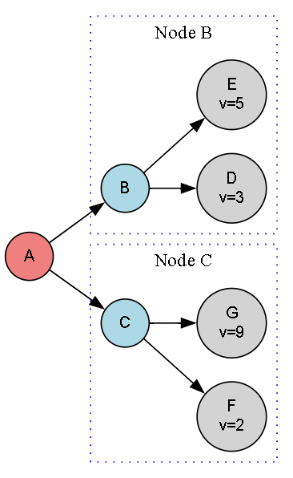

# ♟️Alpha-Beta Pruning Algorithm in Game Trees

This project implements the Alpha-Beta Pruning algorithm, an optimized version of the Minimax algorithm. It efficiently computes the optimal value for a player in a two-player zero-sum game by pruning branches that won’t influence the final decision.

---

## 🚀 About This Algorithm

Alpha-Beta Pruning improves Minimax by cutting off branches that cannot affect the final decision, drastically reducing the number of nodes evaluated in the game tree. This makes it faster and more efficient while still guaranteeing the same optimal result.

---

## 🧠 How the Algorithm Works

The algorithm recursively explores the game tree by alternating between maximizing and minimizing players:

- Maximizing Player tries to maximize the score.
- Minimizing Player tries to minimize the score.

Two parameters, alpha and beta, track the best already explored options for maximizing and minimizing players respectively:

-  `alpha`: The highest value the maximizer currently can guarantee.
- `beta`: The lowest value the minimizer currently can guarantee.

When `beta <= alpha`, the algorithm prunes (stops evaluating) the remaining children of the node because they cannot affect the final decision.

---

### 🪜 Steps:

1. Start at the root node (current game state).
2. Recursively evaluate child nodes by switching between maximizing and minimizing at each level.
3. Update **alpha** and **beta** values as better options are found.
4. Prune branches where no better outcomes can be achieved `(beta <= alpha)`.
5. Return the optimal value for the root node once all relevant nodes are evaluated.

---

## 🖼️ Input & Output

### 📥 Input Graph Structure

<p align="center">
  
  <br/>
  <em>Alpha-Beta Pruning Game Tree Visualization</em>
</p>

---

### 📤 Output Path

```python
The optimal value from node 'A' is: 3
```
---

## 🌍 Applications of Alpha-Beta Pruning

- ♟️ **Chess Engines and Other Board Games**  
- 🃏 **Game AI Decision Making**  
- 🤖 **Two-Player Competitive Games**  
- 🎮 **Minimax Optimization in Game Trees**  

---

## ⏱️ Time & Space Complexity

<div align="center">

| Type             | Complexity                   |
|------------------|-----------------------------|
| **Time Complexity**  | O(b^(m/2)) where b = branching factor, m = max depth  |
| **Space Complexity** | O(m), proportional to max tree depth  |

</div>

> Alpha-Beta pruning can roughly double the depth of search compared to Minimax alone by pruning large parts of the tree.

