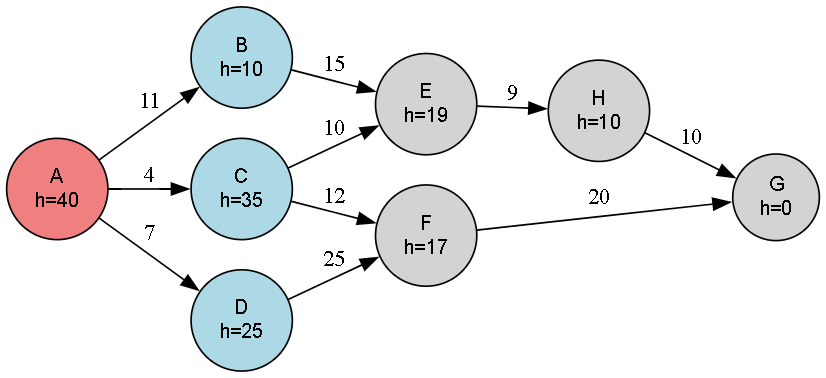

# 🔦 Beam Search Algorithm for Informed Graph Traversal

This code implements the Beam Search algorithm, a heuristic-based search technique that explores a limited number of best options at each level, based on heuristic estimates. It's a balance between **breadth-first search** and **greedy best-first search**, offering efficiency and speed in large search spaces.

---

## 🚀 About This Algorithm

Beam Search is ideal when the full breadth of the tree is too large to explore. It only considers a beam width number of best nodes at every level — pruning others to save time and memory.

- It uses heuristics to determine the most promising paths.
- Operates like best-first search but limits the number of nodes explored at each level.
- Often used in AI systems where speed is crucial and full accuracy can be traded for performance.
  
---

## 🧠 How the Algorithm Works

- Begins at a **start node**, evaluating all immediate neighbors.
- Selects the top k `(beam width)` neighbors with the lowest heuristic values.
- Explores only these nodes in the next level, discarding others.
- Repeats until the goal node is found or the graph is exhausted.

---

### 🪜 Steps:

1. Add the **start node** to the open list with its heuristic.
2. At each iteration:
   - Pick the node with the lowest heuristic.
   - Expand its neighbors and add them to the open list if not already visited.
3. **Prune** the open list to retain only the top beam width nodes.
4. Stop when the goal is **reached**.
5. Return the visited path.
---

## 🖼️ Input & Output

### 📥 Input Graph Structure

<p align="center">
  
  <br/>
  <em>Beam Search Algorithm Graph Visualization</em>
</p>

---

### 📤 Output Path

```python
Evolution of Open List at Each Step (Debug Trace):
Current open list: [(10, 'B'), (25, 'D'), (35, 'C')]
Current open list: [(19, 'E'), (25, 'D'), (35, 'C')]
Current open list: [(10, 'H'), (25, 'D'), (35, 'C')]
Current open list: [(0, 'G'), (25, 'D'), (35, 'C')]

Optimal Solution Path: A->B->E->H->G
```
---

## 🌍 Applications of Beam Search

- 🤖 **Speech Recognition**
- ✨ **Natural Language Processing**
- 🔎 **redictive Typing & Autocomplete**
- 🎮 **Game AI (fast path prediction)**
- 🧠 **Heuristic Search in Large Graphs**

---

## ⏱️ Time & Space Complexity

<div align="center">

| Type             | Complexity                   |
|------------------|-----------------------------|
| **Time Complexity**  | O(b^k), where `b` is beam width & `k` is depth  |
| **Space Complexity** | O(b), maintains only top nodes per level  |

</div>

> Beam Search is faster than BFS/DFS in large graphs but may miss the optimal path due to aggressive pruning.

