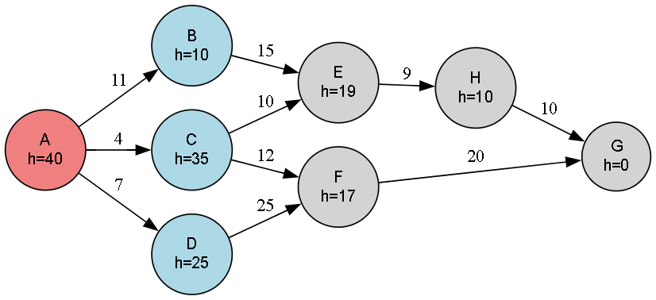

# ⚡Greedy Best-First Search Algorithm for Heuristic Pathfinding

This code implements the Greedy Best-First Search (GBFS) algorithm — a heuristic-driven search strategy that always expands the node that appears to be closest to the goal based on heuristic estimates. It offers fast results, especially in vast graphs, although it doesn’t guarantee the optimal path.

---

## 🚀 About This Algorithm

Greedy Best-First Search explores a graph by always selecting the node with the lowest heuristic cost `(h(n))` — meaning it believes that node is "closest" to the goal.

- Uses only heuristic values, ignoring actual path cost.
- Fast and memory-efficient for large search spaces.
- May miss the optimal path, unlike **A***.
  
---

## 🧠 How the Algorithm Works

- Starts from the initial node.
- Selects the neighbor with the lowest heuristic estimate to the goal.
- Adds this to a **priority queue** (min-heap).
- Repeats until the goal is reached or all nodes are visited.

---

### 🪜 Steps:

1. Add the **start node** to the open list (priority queue) with its heuristic.
2. While the open list isn't empty:
   - Pop the node with the lowest heuristic.
   - If it’s the goal, stop.
   - Else, expand its neighbors and push them into the open list.
3. Return the path traversed (not necessarily the optimal one).

---

## 🖼️ Input & Output

### 📥 Input Graph Structure

<p align="center">
  
  <br/>
  <em>Greedy Best-First Search - Graph Visualization with Heuristic Costs</em>
</p>

---

### 📤 Output Path

```python
Traversal Path (based on heuristic preference):
A->B->E->H->G
```
> Note: This is not guaranteed to be optimal, but chosen based on lowest heuristic values.
---

## 🌍 Applications of Best-First Search

- 🧠 **Pathfinding in AI Games**  
- 📱 **Route Planning & Navigation Systems**  
- 🤖 **Robotics (Obstacle Avoidance)**  
- 🧬 **Protein Folding Simulations**
- 📝 **Autocompletion and Word Suggestions**

---

## ⏱️ Time & Space Complexity

<div align="center">

| Type             | Complexity                   |
|------------------|-----------------------------|
| **Time Complexity**  | O(b<sup>m</sup>), where `b` = branching factor, `m` = depth  |
| **Space Complexity** | O(b<sup>m</sup>) (similar to BFS but can be lower due to heuristics)  |

</div>

> Greedy Best-First is **not complete and not optimal** — it may ignore shorter paths in favor of heuristically better-looking ones.

