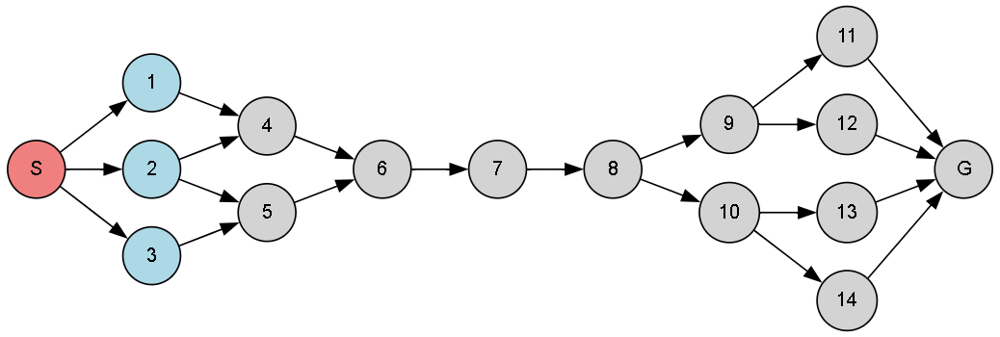

# 🔄 Bidirectional Breadth-First Search (BFS) Algorithm

This implementation showcases the Bidirectional BFS algorithm — a powerful search technique that simultaneously searches forward from the source and backward from the goal, aiming to meet in the middle and reduce the overall search space.

---

## 🚀 About This Algorithm

**Bidirectional BFS** speeds up the traditional BFS by launching two simultaneous searches:
one from the **start** and one from the **goal**.

- Drastically reduces time complexity compared to classic BFS.
- Efficient for large graphs where paths are long.
- Especially powerful in undirected or reversible graphs.

---

## 🧠 How the Algorithm Works

- Maintains two frontiers:
  - One starts from the **initial node**
  - The other starts from the **goal node**
- Each search proceeds in BFS manner.
- The algorithm halts when the two searches meet.

---

### 🪜 Steps:

1. Initialize two queues: `forward_queue` and `backward_queue`.
2. Expand nodes level-by-level from **both ends**.
3. At each step:
   - Expand a node from the forward queue and mark visited.
   - Expand a node from the backward queue and mark visited.
4. If a node is visited by both frontiers — a meeting point is found.
5. Trace back the path using parent maps.

---

## 🖼️ Input & Output

### 📥 Input Graph Structure

<p align="center">
  
  <br/>
  <em>Bidirectional Search - Graph Visualization of Forward and Backward Exploration</em>
</p>

---

### 📤 Output Path

```python
Path from S to G: ['S', '1', '4', '6', '7', '8', '9', '11', 'G']
```
> The returned path may vary depending on node traversal order — all valid shortest paths!

---
## 🌍 Applications of Bidirectional Search

- 📍 **GPS Navigation & Route Optimization**  
- 🔎 **Social Network Path Tracing (e.g., LinkedIn’s mutual connection path)**  
- 🧩 **Puzzle Solvers (e.g., 8-puzzle, Rubik’s cube)**  
- 🤖 **AI Agents in Gaming & Robotics**
- 💾 **Network Routing Algorithms**

---

## ⏱️ Time & Space Complexity

<div align="center">

| Type             | Complexity                   |
|------------------|-----------------------------|
| **Time Complexity**  | O(b<sup>d/2</sup> + b<sup>d/2</sup>) = O(b<sup>d/2</sup>)  |
| **Space Complexity** | O(b<sup>d/2</sup>)  |

</div>

> **Bidirectional BFS** is optimal and complete, provided the search space is undirected or bidirectional.

