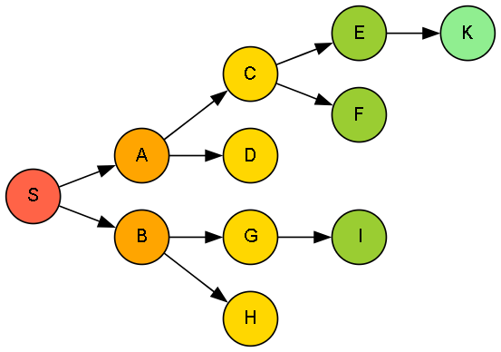

# 🧭 Breadth-First Search (BFS) Traversal Algorithm

This implementation demonstrates the Breadth-First Search (BFS) algorithm — a classic graph traversal method that explores nodes level-by-level, making it ideal for finding the shortest path in unweighted graphs.

---

## 🚀 About This Algorithm

**Breadth-First Search** begins at a root node and explores all neighboring nodes first, before moving on to the next level of neighbors.

- Uses a **queue** data structure.
- Explores nodes in the order they are discovered.
- Ideal for shortest path problems in unweighted graphs.
- Guarantees the shortest path (by edge count) in such graphs.
  
---

## 🧠 How the Algorithm Works

- Starts from a chosen **start** node.
- Uses a **queue** to keep track of discovered nodes.
- Marks **nodes as visited** to avoid repetition.
- Continues until all reachable nodes have been visited.

---

### 🪜 Steps:

1. Initialize a queue with the **start node**.
2. Repeat while the queue is not empty:
   - Remove the node at the front.
   - If not visited, mark it and process its neighbors.
   - Add all unvisited neighbors to the queue.
3. Continue until all reachable nodes are traversed.

---

## 🖼️ Input & Output

### 📥 Input Graph Structure

<p align="center">
  
  <br/>
  <em>Breadth-First Search - Graph Level-Wise Exploration</em>
</p>

---

### 📤 Output Path

```python
Traversal Path:
S->A->B->C->D->G->H->E->F->I->K
```
> Nodes are printed in the order they are visited level-by-level from the source.
---

## 🌍 Applications of Breadth-First Search (BFS)

- 📍 **Shortest Path in Unweighted Graphs**  
- 🧠 **AI for Pathfinding (e.g., Pac-Man, Chess AI)**  
- 🔄 **Web Crawlers / Site Navigation**  
- 🕸️ **Network Broadcasting & P2P Networks**
- 💬 **Social Network Friend Suggestions**

---

## ⏱️ Time & Space Complexity

<div align="center">

| Type             | Complexity                   |
|------------------|-----------------------------|
| **Time Complexity**  | O(V + E)  |
| **Space Complexity** | O(V) for visited + queue  |

</div>

>Where V = number of vertices, E = number of edges.

