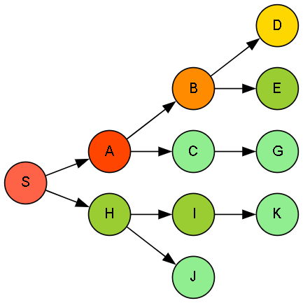

# 🌲 Depth-First Search (DFS) Traversal Algorithm

This implementation demonstrates the **Depth-First Search (DFS)** algorithm — a classic graph traversal technique that explores as far as possible along each branch before backtracking, ideal for exhaustive search and pathfinding in graphs.

---

## 🚀 About This Algorithm

**Depth-First Search** explores nodes by diving deep into each branch before moving to the next sibling node.

- Uses recursion or a **stack** data structure.
- Explores a path fully before backtracking.
- Useful for detecting cycles, connectivity, and topological sorting.
- Can be applied in solving puzzles, maze traversal, and pathfinding.
  
---

## 🧠 How the Algorithm Works

- Starts from a chosen **start** node.
- Marks nodes as visited to prevent cycles.
- Recursively explores unvisited neighbors **deeply**.
- Backtracks once no more unvisited neighbors are available.

---

### 🪜 Steps:

1. Begin at the **start node**.
2. Mark the current node as visited and process it.
3. For each unvisited neighbor, recursively apply DFS.
4. Continue until all reachable nodes are visited.

---

## 🖼️ Input & Output

### 📥 Input Graph Structure

<p align="center">
  
  <br/>
  <em>Depth-First Search - Deep Exploration of Graph Branches</em>
</p>

---

### 📤 Output Path

```python
Traversal Order:
S->A->B->D->E->C->G->H->I->K->J
```
> Nodes are printed in the order they are visited deeply before backtracking.
---

## 🌍 Applications of Depth-First Search (DFS)

- 🕵️‍♂️ **Cycle Detection in Graphs**  
- 🗺️ **Maze & Puzzle Solving**  
- 📊 **Topological Sorting in Directed Acyclic Graphs (DAGs)**  
- 🔎 **Connectivity Testing**
- 🤖 **AI Search & Backtracking Algorithms**

---

## ⏱️ Time & Space Complexity

<div align="center">

| Type             | Complexity                   |
|------------------|-----------------------------|
| **Time Complexity**  | O(V + E)  |
| **Space Complexity** | O(V) for recursion stack and visited set  |

</div>

>Where V = number of vertices, E = number of edges.

