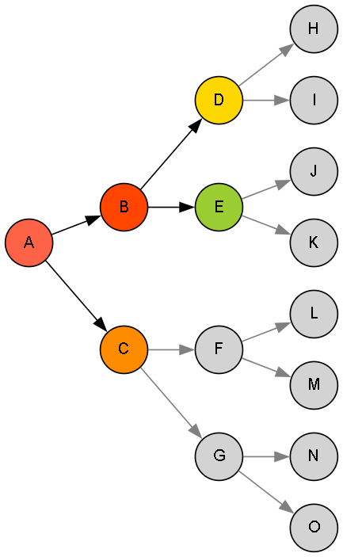

# 🌳 Depth-Limited Search (DLS) Algorithm

This implementation demonstrates the **Depth-Limited Search (DLS)** algorithm — a variation of DFS that explores paths deeply but only up to a fixed depth limit, preventing infinite descent in cyclic or infinite graphs.

---

## 🚀 About This Algorithm

**Depth-Limited Search** traverses nodes deeply like DFS but stops once a specified depth limit is reached.

- Uses recursion with a **depth cutoff**.
- Avoids searching beyond the given depth limit.
- Useful when the search space is large or infinite.
- Acts as a building block for **Iterative Deepening Search (IDS)**.
  
---

## 🧠 How the Algorithm Works

- Starts from a start node with an initial depth of zero.
- Recursively explores neighbors, increasing depth by one each step.
- Stops recursion if the current depth exceeds the **limit**.
- If the goal is found within the limit, search ends successfully.
- Tracks if the limit is crossed without finding the goal.

---

### 🪜 Steps:

1. Begin at the **start node** with depth = 0.
2. If current node equals the goal, mark found and record path.
3. If depth exceeds the **limit**, stop recursion and note limit crossed.
4. Otherwise, recursively search each unvisited neighbor at **depth + 1**.
5. Continue until goal found or all paths within limit are explored.

---

## 🖼️ Input & Output

### 📥 Input Graph Structure

<p align="center">
  
  <br/>
  <em>Depth-Limited Search - Controlled Deep Exploration</em>
</p>

---

### 📤 Output Path

```python
Traversal Order:
A->B->D
```
> The path found within the depth limit. If no path is found within the limit, an appropriate message is shown.
---

## 🌍 Applications of Depth-Limited Search (DLS)

- 🔍 **Searching large or infinite search spaces with limited depth**  
- ⚙️ **Constraint satisfaction problems with depth limits**  
- 🧩 **Puzzle solving where depth needs bounding**  
- 🛡️ **Avoiding infinite loops in cyclic graphs**
- ⏳ **Foundation for Iterative Deepening Search (IDS)**

---

## ⏱️ Time & Space Complexity

<div align="center">

| Type             | Complexity                   |
|------------------|-----------------------------|
| **Time Complexity**  | O(b^l) (b = branching factor, l = depth limit)  |
| **Space Complexity** | O(l) for recursion stack and visited set  |

</div>

>Where b is the average branching factor and l is the depth limit.

