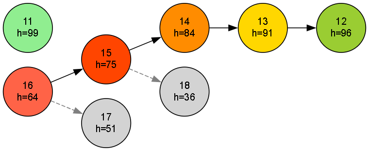

# ⛰️ Hill Climbing Algorithm

This implementation demonstrates the Hill Climbing algorithm — a local search technique used for optimization problems that iteratively moves towards better states based on a heuristic function, aiming to find a peak or optimal solution.

---

## 🚀 About This Algorithm

**Hill Climbing** is an iterative search algorithm that continuously moves to neighboring states with higher heuristic values, seeking to maximize the heuristic score.

- Starts from an initial state.
- Examines neighboring states.
- Moves to the neighbor with the highest heuristic value if it is better than the current state.
- Stops when no neighbor has a better heuristic (local maximum reached).
- Simple and efficient for many optimization tasks but may get stuck at local maxima.

---

## 🧠 How the Algorithm Works

- Begin at the **initial state**.
- Generate all **neighbors** of the current state.
- Evaluate the heuristic value of each neighbor.
- Select the neighbor with the highest **heuristic** value.
- Move to this neighbor if its heuristic is greater than the current state.
- Repeat until no neighbor improves the heuristic.
- Return the current state as the local optimum.

---

### 🪜 Steps:

1. Start at the **initial state**.
2. Compute heuristic values of neighbors.
3. Select the neighbor with the highest heuristic.
4. If no neighbor is better, terminate.
5. Otherwise, move to the better neighbor.
6. Repeat steps 2–5 until termination.

---

## 🖼️ Input & Output

### 📥 Input Graph Structure

<p align="center">
  
  <br/>
  <em>Hill Climbing Algorithm - Iterative Improvement Towards Peak</em>
</p>

> - Each state has a value and a heuristic function that estimates its quality or fitness.
> - Neighbors are generated by incrementing or decrementing the state value by 1.

---

### 📤 Output Path

```python
Result: State{ value=10, heuristic=100 }
```
> The algorithm finds the local maximum heuristic state starting from the initial value (16), converging at value 10 with the highest heuristic 100.
---

## 🌍 Applications of Hill Climbing

- 🎯 **Optimization problems (e.g., scheduling, route planning)**  
- 🧩 **Function maximization/minimization**  
- 🤖 **Artificial Intelligence search and learning**  
- 🚀 **Feature selection in machine learning**
- 🎮 **Game playing and decision making**

---

## ⏱️ Time & Space Complexity

<div align="center">

| Type             | Complexity                   |
|------------------|-----------------------------|
| **Time Complexity**  | O(k * b) (k = steps to local max, b = branching factor)  |
| **Space Complexity** | O(b) for storing neighbors  |

</div>

>Where k depends on the landscape of the heuristic function and starting point.

