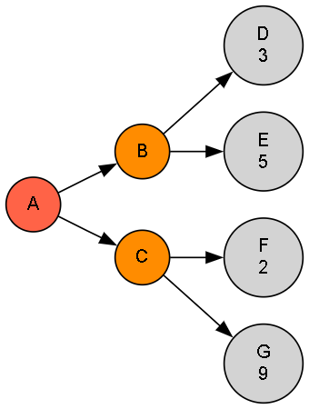

# 🎲 Minimax Algorithm

This implementation demonstrates the **Minimax algorithm** — a decision rule used in two-player zero-sum games to find the optimal move by minimizing the possible loss in the worst-case scenario.

---

## 🚀 About This Algorithm

**Minimax** is a recursive strategy that simulates all possible moves in a game tree, assuming both players play optimally:

- **Maximizing player** tries to maximize the score.
- **Minimizing player** tries to minimize the score.
- Recursively evaluates the game tree from the current node down to terminal states (leaf nodes with numeric scores).
- Chooses the move that leads to the best guaranteed outcome assuming perfect play from both sides.
- Commonly used in games like Tic-Tac-Toe, Chess, and Checkers.
  
---

## 🧠 How the Algorithm Works

- Start at the **root node** representing the current game state.
- If the node is a **terminal node** (leaf), return its numeric value.
- Otherwise, recursively evaluate the **left** and **right** child nodes.
- If it’s the **maximizing player**’s turn, select the maximum of the child nodes' values.
- If it’s the **minimizing player**’s turn, select the minimum of the child nodes' values.
- Propagate this value up the tree until the root node's best move value is determined.

---

### 🪜 Steps:

1. Check if the current node is terminal. If yes, return its value.
2. Recursively apply Minimax to the left and right child nodes.
3. If maximizing player: return max of left and right child values.
4. If minimizing player: return min of left and right child values.
5. Repeat until the root node's best value is computed.

---

## 🖼️ Input & Output

### 📥 Input Graph Structure

<p align="center">
  
  <br/>
  <em>Minimax Algorithm – Optimal Decision Making in Adversarial Games</em>
</p>

> - Each internal node represents a game state with two possible moves (children).
> - Leaf nodes contain numeric scores representing the game's outcome from the maximizing player’s perspective.

---

### 📤 Output Path

```python
Best value for the root: 3
```
> The best achievable value for the maximizing player starting at node 'A' is 3, assuming both players play optimally.
---

## 🌍 Applications of Hill Climbing

- 🎮 **Turn-based games like Tic-Tac-Toe, Chess, and Checkers**
- 🤖 **AI opponents in competitive environments**
- 🔍 **Decision making under adversarial conditions**
- 🕹️ **Game tree exploration and evaluation**

---

## ⏱️ Time & Space Complexity

<div align="center">

| Type             | Complexity                   |
|------------------|-----------------------------|
| **Time Complexity**  | O(b^d) (b = branching factor, d = depth of tree)  |
| **Space Complexity** | O(d) for recursion stack  |

</div>

>Where b is the average number of children per node, and d is the maximum depth of the game tree.

